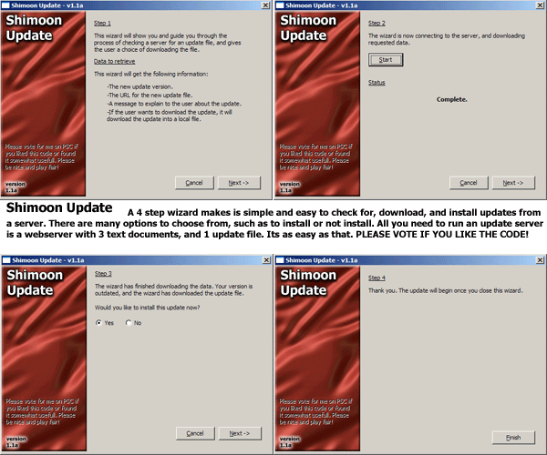

## Shimoon Update 1\.1a

### Description

Hey guys check this one out! It can be used in any application! This will check a server for, download, and install an update! So if you are constantly fixing bugs in your apps, or adding new features, this code is for you. (if you like it you can use it in your apps you dont even have to give me credit). Well heres the beauty of it - it is in a 4 step wizard. It will compare the versions to see if you need an update. If you do, then it downloads it and asks you if you want to install it. PLEASE VOTE FOR IT IF YOU LIKE IT!
 
### More Info
 

             |
---                |---
**Submitted On**   |2001-11-15 07:36:16
**By**             |[Armen Shimoon](https://github.com/Planet-Source-Code/PSCIndex/blob/master/ByAuthor/armen-shimoon.md)
**Level**          |Beginner
**User Rating**    |4.7 (56 globes from 12 users)
**Compatibility**  |VB 5\.0, VB 6\.0
**Category**       |[Internet/ HTML](https://github.com/Planet-Source-Code/PSCIndex/blob/master/ByCategory/internet-html__1-34.md)
**World**          |[Visual Basic](https://github.com/Planet-Source-Code/PSCIndex/blob/master/ByWorld/visual-basic.md)
**Archive File**   |[Shimoon\_Up3536711152001\.zip](https://github.com/Planet-Source-Code/armen-shimoon-shimoon-update-1-1a__1-28923/archive/master.zip)

